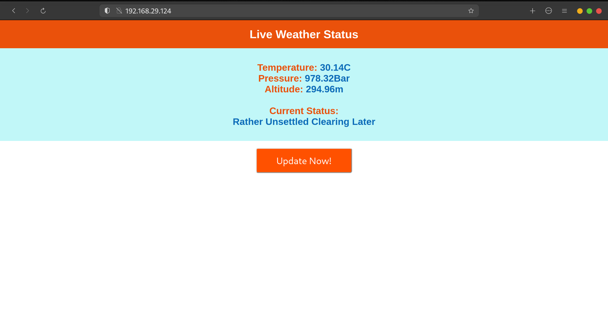

# ESP8266-Weather-status-BMP280
ESP8266 code to get Weather Status using BMP280. Uses algorithmic version of the Zambretti Forecaster as used in Meteor2000D. Async server with Websockets used for fast live updates.  
The relevant IP address is given through the Serial monitor and can be used the access the Web interface.

